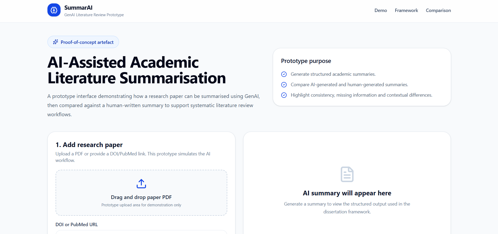
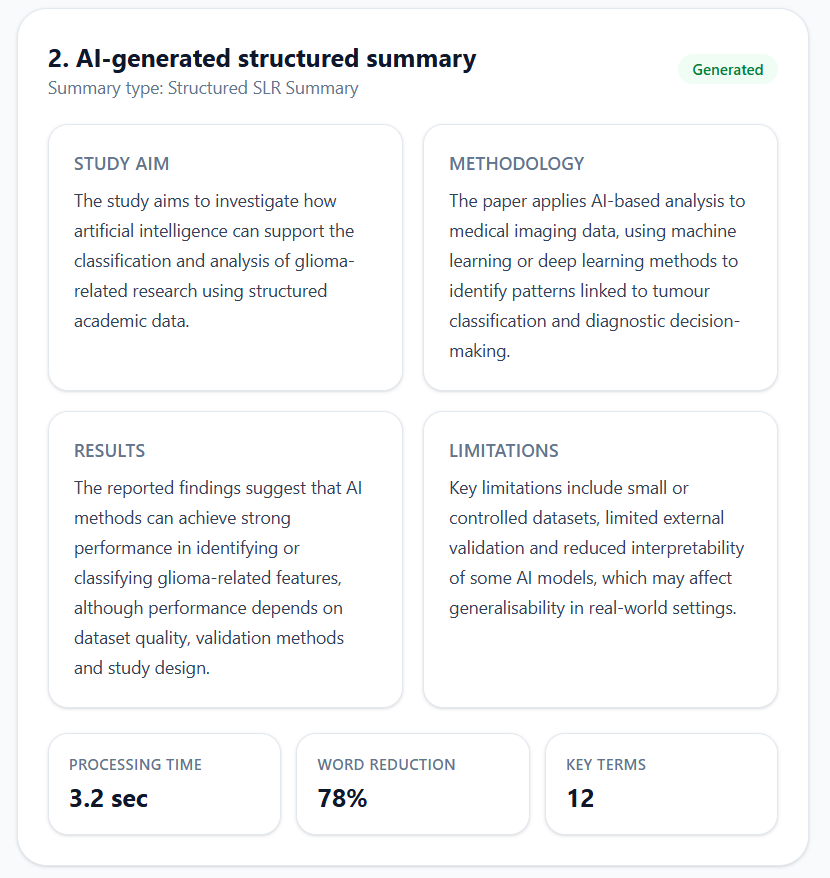
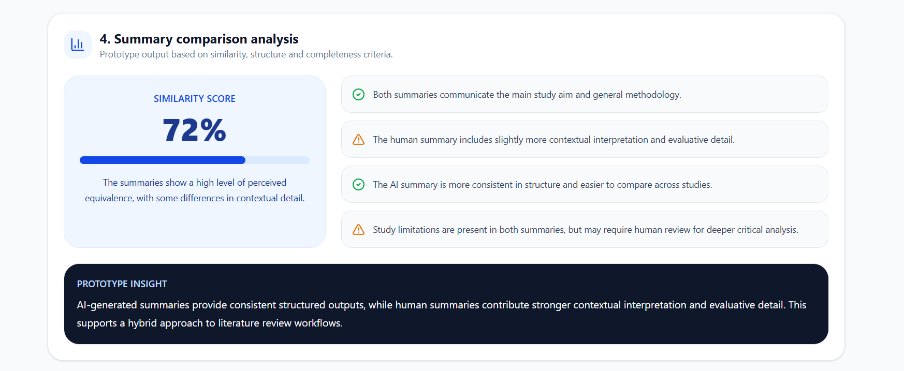

# SummarAI Prototype

A proof-of-concept prototype developed as part of a computing dissertation exploring AI-assisted academic literature summarisation and human versus AI summary comparison workflows.

---

## Features

- AI-assisted structured literature summaries
- Human vs AI summary comparison
- Similarity evaluation dashboard
- Prototype systematic literature review workflow
- React + Tailwind interface

---

## Prototype Screenshots

### Dashboard



---

### AI Summary Output



---

### Comparison Analysis



---

## Technologies Used

- React
- Vite
- Tailwind CSS
- Framer Motion
- Lucide React Icons

---

## Dissertation Context

This prototype was developed to support research into the effectiveness of AI-assisted academic literature summarisation. The system demonstrates how AI-generated summaries can be compared against human-written summaries to evaluate similarity, completeness and contextual interpretation.

---

## Running the Project

```bash
npm install
npm run dev
```
